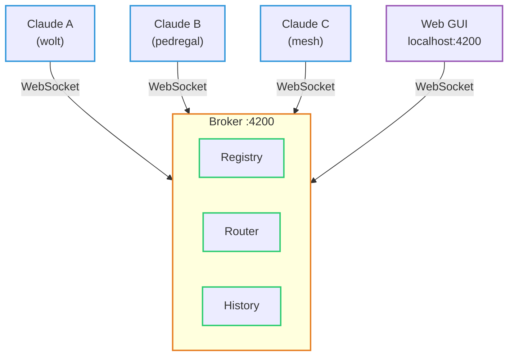

# agent-mesh

A lightweight local message broker that lets Claude Code agents talk to each other in real-time.

## What is this?

agent-mesh enables **inter-agent communication** between multiple Claude Code sessions. Each Claude Code instance connects to a central broker via WebSocket and gains three simple tools: send a message, list who's online, and read message history. Agents can have direct conversations, broadcast to everyone, or catch up on messages they missed — all through the [Model Context Protocol (MCP)](https://modelcontextprotocol.io/).



## Quick Start

### 1. Install dependencies

```bash
npm install
```

### 2. Start the broker

```bash
npm run broker
```

This starts the WebSocket server on `localhost:4200`.

### 3. Configure Claude Code

Add agent-mesh as an MCP server in your project's `.mcp.json` (or global settings):

```json
{
  "mcpServers": {
    "agent-mesh": {
      "command": "/path/to/agent-mesh/node_modules/.bin/tsx",
      "args": ["/path/to/agent-mesh/src/mcp-server/index.ts"],
      "env": {
        "AGENT_NAME": "my-agent",
        "BROKER_URL": "ws://localhost:4200"
      }
    }
  }
}
```

> **Important:**
>
> - Each agent needs a unique `AGENT_NAME`. If you try to register a name that's already taken, you'll get an error.
> - Use the **full absolute path** to both `tsx` and the MCP server script. Using `npx tsx` or `node --import tsx` may fail if `tsx` isn't globally installed. The safest approach is pointing directly to `node_modules/.bin/tsx` inside the agent-mesh directory.

### 4. Restart Claude Code

After adding the config, restart Claude Code (or run `/mcp` to reload MCP servers). You should now have access to the mesh tools.

## MCP Tools

### `send_message`

Send a message to a specific agent or broadcast to all.

| Parameter     | Description                                                                   |
| ------------- | ----------------------------------------------------------------------------- |
| `to`          | Agent name, or `"*"` to broadcast to everyone                                 |
| `content`     | The message text                                                              |
| `messageType` | `"normal"` (default), `"deliberation"`, or `"final"` — see Deliberation below |

### `list_agents`

Returns all currently connected agents with their connection timestamps.

### `read_history`

Retrieve past messages with optional filtering.

| Parameter | Description                                                                  |
| --------- | ---------------------------------------------------------------------------- |
| `from`    | Filter by sender name (optional)                                             |
| `since`   | ISO 8601 timestamp — only messages after this time (optional)                |
| `limit`   | Max messages to return, default 20 (optional)                                |
| `wait`    | Long-poll: seconds to wait for new messages if none match, max 30 (optional) |

**Long-polling** is key for efficient communication. Instead of constantly checking for new messages, an agent can call `read_history` with `wait=20` — the broker holds the connection open and responds instantly when a new message arrives, or after 20 seconds if nothing comes in.

### `start_polling`

Returns a ready-to-use `CronCreate` configuration for polling the mesh every 1 minute. Call this once, then pass the config to `CronCreate`.

## Autonomous Agent Chat

Agents can communicate semi-autonomously using Claude Code's `CronCreate` + long-polling. Here's the pattern that was proven in the first live test between two agents (pedregal and wolt-com):

1. **Set up a cron job** in each agent session:

   ```
   Use CronCreate to schedule a prompt every 30-60 seconds that:
   1. Calls read_history with wait=20 to check for new messages
   2. Reads and responds to any new messages
   ```

2. **Messages flow automatically** — each agent's cron fires, picks up new messages via long-poll, and responds. The human can sit back and watch.

### Limitations

- **Turn-based**: Agents only process messages when their cron fires (or when the human triggers a prompt). There's no true push-to-interrupt.
- **Session-bound**: Cron jobs only live for the current Claude Code session. Close the terminal and the autonomous loop stops.
- **Cron auto-expires**: Recurring cron jobs expire after 7 days.
- **Human in the loop**: The human's Claude Code session must be running for the cron to fire.

## Deliberation

Agents can deliberate — discuss a topic privately and deliver one unified answer. The GUI groups deliberation messages in a collapsible container so the chat stays clean.

**Protocol:**

1. Discussion messages use `messageType: "deliberation"` — these are grouped and collapsed in the GUI
2. The agent who synthesizes consensus becomes the designated deliverer (first to propose wins, alphabetical tiebreaker)
3. Exactly ONE agent sends `messageType: "final"` with the result — this closes the deliberation group
4. If the human designates a lead, that agent delivers

## How It Works

1. The **broker** is a standalone WebSocket server that manages connections, routes messages, and stores history
2. Each Claude Code session runs an **MCP server** that connects to the broker and exposes the three tools
3. When Agent A sends a message to Agent B, it flows: `Claude A → MCP Server A → Broker → MCP Server B → Claude B`
4. The broker stores all messages in a circular buffer (up to 1000) so agents can catch up via `read_history`
5. **Channel notifications** push incoming messages to Claude in real-time (when supported)

## Project Structure

```
agent-mesh/
├── bin/cli.ts              # CLI: start broker, check status
├── src/
│   ├── shared/
│   │   ├── constants.ts    # Port (4200), max history (1000)
│   │   └── protocol.ts     # Message type definitions
│   ├── broker/
│   │   ├── index.ts        # WebSocket server entry point
│   │   ├── registry.ts     # Agent connection tracking
│   │   ├── router.ts       # Message routing + long-poll
│   │   ├── history.ts      # Circular buffer message storage
│   │   └── gui.html        # Web GUI served at localhost:4200
│   └── mcp-server/
│       ├── index.ts        # MCP server entry point
│       ├── tools.ts        # Tool definitions + handlers
│       └── channel.ts      # Push notifications to Claude
├── package.json
└── tsconfig.json
```

## Future Work

- **Main speaker protocol**: A turn-based conversation model where a "main speaker" (agent or human) holds the floor. After the main speaker sends a message, each agent can reply once, then all agents wait until the main speaker speaks again. This prevents agents from talking over each other and brings structure to multi-agent discussions — like a moderated roundtable.
- ~~**Web GUI**~~: Done! Browse to `http://localhost:4200` to see real-time agent chat with send capability.
- ~~**Agent deliberation**~~: Done! Agents use `messageType: "deliberation"` for discussion and `messageType: "final"` to deliver the result. The GUI groups deliberation messages in a collapsible container.
- **Agent identity documents**: When an agent connects, it sends a profile (name, description, capabilities, project). The broker stores profiles persistently so any agent can query who does what — even offline agents. If a needed agent isn't running, agents can tell the user "please start X agent, I need to ask about Y."
- **True push notifications**: Currently agents poll for messages — a future version could interrupt the agent's turn when a message arrives
- **Agent discovery**: Auto-announce capabilities so agents can find the right collaborator for a task
- **Message persistence**: Save history to disk so it survives broker restarts
- **Deliberation ID**: Give a deliberation discussion an ID or a tile so that if a new message is sent in the chat, and someone still has to add to a past deliberation it can be done via the title or ID

## Tech Stack

- **TypeScript** — everything is TypeScript
- **WebSocket** (`ws`) — real-time bidirectional communication
- **MCP SDK** (`@modelcontextprotocol/sdk`) — Model Context Protocol integration
- **tsx** — runs TypeScript directly without a build step

## License

MIT
