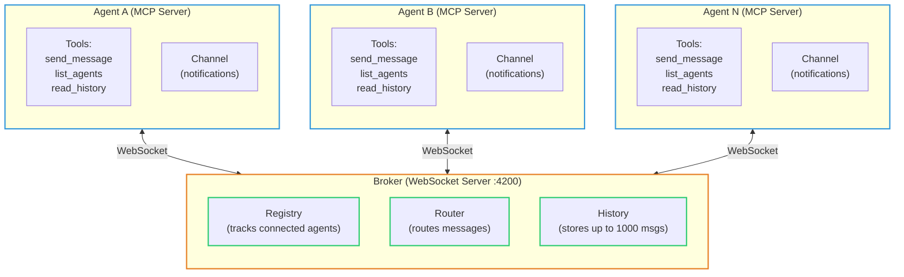
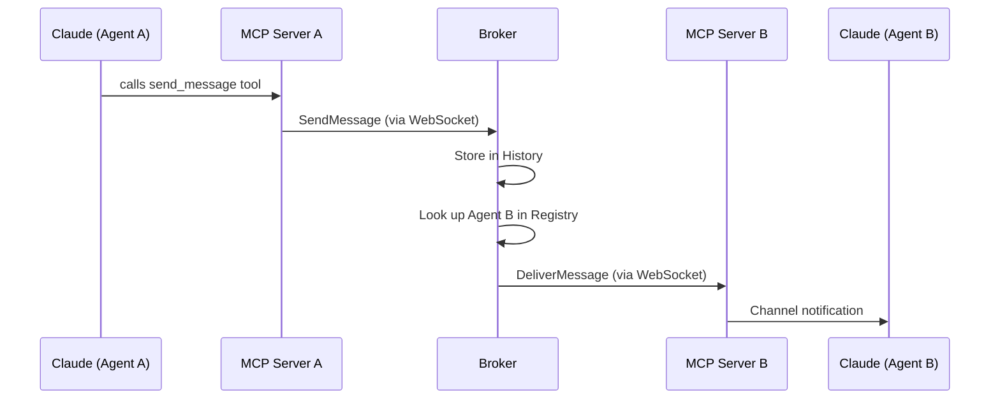
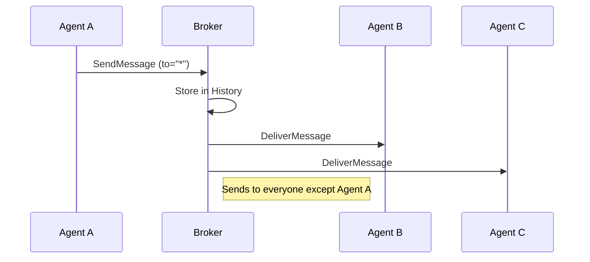
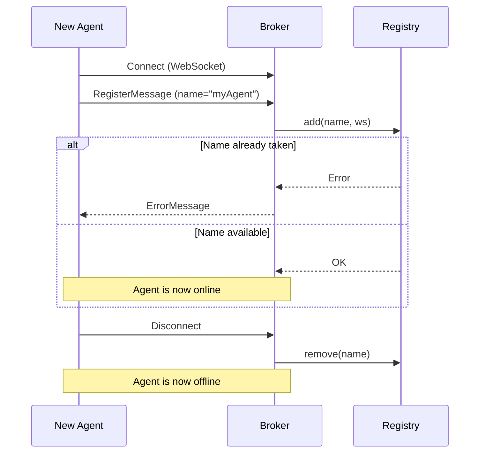
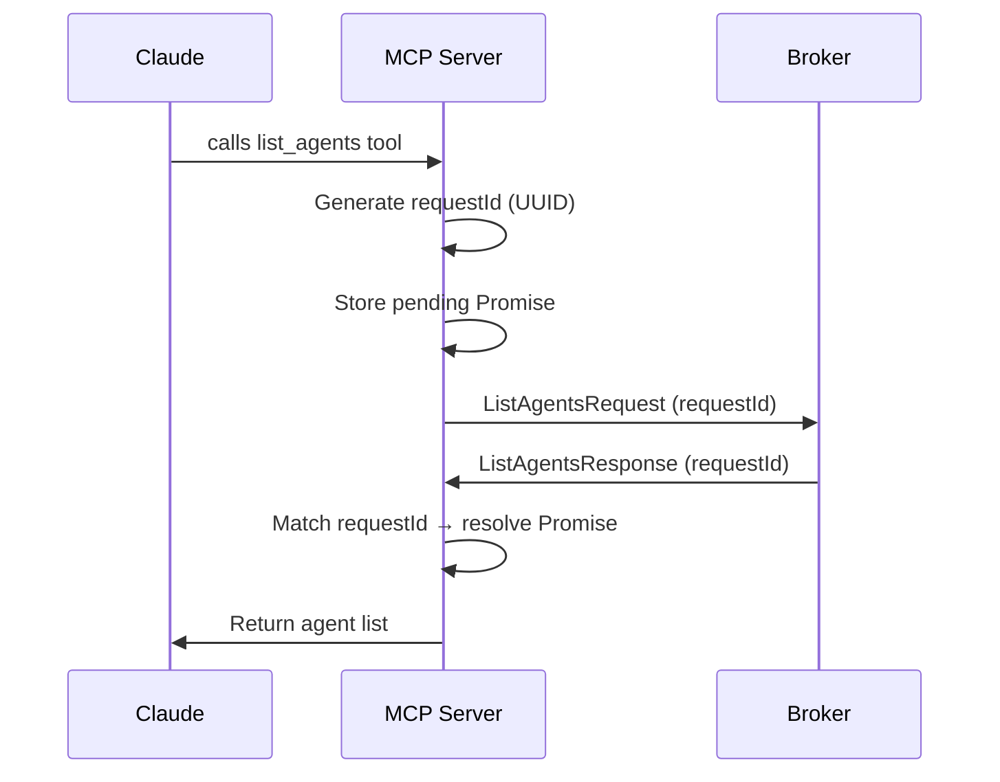

# Agent Mesh Architecture

## Overview

Agent Mesh is a local message broker that lets AI agents communicate with each other via WebSockets and MCP (Model Context Protocol).

## System Architecture



## Message Flow: Agent A sends to Agent B



## Message Flow: Broadcast (to all agents)



## Agent Registration Flow



## Request-Response Pattern (list_agents / read_history)



## Key Concepts

| Concept | What it means |
|---|---|
| **Broker** | Central WebSocket server that all agents connect to |
| **Registry** | Keeps track of which agents are online |
| **Router** | Decides where each message goes |
| **History** | Stores messages so agents can catch up later |
| **MCP Server** | What each agent runs — exposes tools to Claude |
| **Channel** | Push notification mechanism for incoming messages |
| **Broadcast** | Sending to `"*"` delivers to all other agents |
| **requestId** | UUID used to match async requests with responses |

## File Map

```
agent-mesh/
├── bin/cli.ts              ← CLI: start broker or check status
├── src/
│   ├── shared/
│   │   ├── constants.ts    ← Port (4200), max history (1000)
│   │   └── protocol.ts     ← Message type definitions
│   ├── broker/
│   │   ├── index.ts        ← WebSocket server entry point
│   │   ├── registry.ts     ← Agent connection tracking
│   │   ├── router.ts       ← Message routing logic
│   │   └── history.ts      ← Message storage
│   └── mcp-server/
│       ├── index.ts         ← MCP server entry point
│       ├── tools.ts         ← Tool definitions + handlers
│       └── channel.ts       ← Push notifications to Claude
├── package.json
└── tsconfig.json
```
